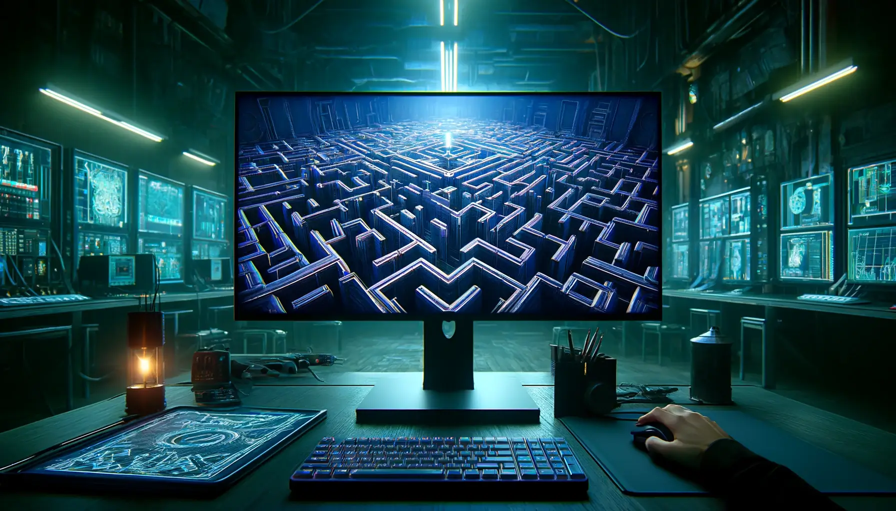

<br>

# Cub3d

## Introduction
Le projet `cub3D` est une implémentation moderne du moteur de jeu classique utilisé dans Wolfenstein 3D, le premier FPS. Ce projet vise à recréer une simulation réaliste d'un environnement 3D en utilisant la technique du raycasting sur une carte 2D.

## Installation
Clonez le dépôt et compilez le projet :
```bash
git clone https://github.com/aceyzz/cub3d-2
cd cub3d-2
make
```

## Exécution
Lancez le programme avec une carte valide :
```bash
./cub3D <chemin/vers/fichier.cub>
```

## Parsing
Le parsing est la première étape cruciale du projet, responsable de la validation et de la lecture des données de configuration à partir d'un fichier .cub.

### Structure du fichier .cub
- Chemins vers les textures pour les murs nord, sud, est et ouest au format xpm
- Couleur du sol et du plafond en RGB (possibilité de définir une texture pour le sol et le plafond au format xpm)
- Carte décrivant l'espace, où les murs et les espaces vides sont marqués respectivement par des 1 et des 0

### Validation
Le parseur vérifie :

- Le format des données de couleur et de texture
- La fermeture des murs sur la carte
- La présence d'au moins une position de départ valide pour le joueur, ainsi que son orientation

## Raycasting
Le raycasting est le cœur du rendu 3D dans cub3D. Cette technique consiste à envoyer des rayons depuis la perspective du joueur pour détecter les murs et déterminer la hauteur des murs à afficher à l'écran.

### Calculs clés
- Distance perpendiculaire du rayon aux murs pour éviter l'effet fisheye
- Hauteur calculée du mur sur l'écran basée sur la distance au mur
- Choix de texture basé sur la face du mur que le rayon rencontre

### Contrôles
Le joueur peut se déplacer dans l'environnement et tourner à l'aide des touches suivantes :

- `W, A, S, D` pour le mouvement du joueur
- `Shift gauche` pour accélérer le mouvement
- `Flèches gauche et droite` pour la rotation de la caméra (la souris est aussi prise en charge)
- `ESC` pour quitter le jeu

### Affichage graphique
Utilisation de la bibliothèque MiniLibX pour créer une fenêtre et gérer les événements clavier.

### Rendu des textures
Les textures des murs sont mappées précisément en utilisant les coordonnées du point d'impact du rayon.

### Optimisations
- Utilisation de DDA ([Digital Differential Analyzer](https://en.wikipedia.org/wiki/Digital_differential_analyzer)) pour l'optimisation du raycasting.
- Calculs limités à l'intérieur du champ de vision du joueur pour réduire la charge de travail.

## Bonus
- Gestion des collisions avec les murs √
- Rotation avec la souris + curseur caché √
- Accélération du joueur avec la touche Shift √
- Mini-map dynamique (en cours)
- Gestion des musiques (en cours)

## Auteur
- [#Chrstphr_0o](https://github.com/ChrstphrChevalier)
- [aceyzz](https://www.github.com/aceyzz)

## License
Ce projet est sous licence MIT.

